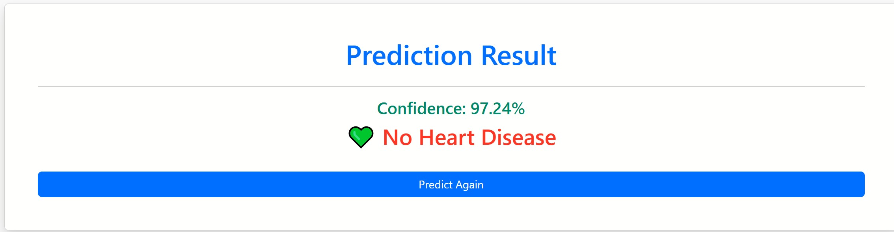

# ❤️ Heart Disease Prediction

A Machine Learning web application that predicts the possibility of heart disease using XGBoost and Flask.

---

## 📌 Project Overview

This project is an end-to-end Machine Learning application that predicts whether a patient is likely to have heart disease based on medical information.

The model is trained using the Heart Disease dataset and deployed with Flask.

---

## 🚀 Features

- Heart Disease Prediction
- XGBoost Machine Learning Model
- Flask Backend
- Bootstrap Responsive UI
- User Input Form
- Prediction Result
- Confidence Score
- Easy to Use Interface

---

## 🛠 Technologies Used

- Python
- Flask
- XGBoost
- Pandas
- NumPy
- Scikit-learn
- Joblib
- HTML
- CSS
- Bootstrap

---

## 📂 Project Structure

Heart-Disease-Prediction/

├── api.py

├── Heart_Attack_Disease_Prediction.pkl

├── requirements.txt

├── static/

│ ├── css/

│ └── images/

└── templates/

├── index.html

└── result.html

## 📸 Screenshots

### 🏠 Home Page



### ❤️ Prediction Result


## 🌐 Live Demo

https://heart-disease-prediction-k9rl.onrender.com

## 📈 Model Performance

- Model: XGBoost Classifier
- Accuracy: 91%


## 📊 Dataset

The model is trained using the Heart Disease dataset containing 13 medical features such as age, cholesterol, chest pain type, blood pressure, etc.


---

## ⚙️ Installation

Clone the repository

```bash
git clone https://github.com/yourusername/Heart-Disease-Prediction.git
```

Go to the project folder

```bash
cd Heart-Disease-Prediction
```

Install dependencies

```bash
pip install -r requirements.txt
```

Run the application

```bash
python api.py
```

Open your browser

```
http://127.0.0.1:5000
```

---

## 📸 Screenshots

Add screenshots of:

- Home Page
- Prediction Result

---

## 📈 Future Improvements

- Better UI Design
- Model Deployment
- User Authentication
- Database Integration
- Deep Learning Model
- Explainable AI (SHAP)

---

## 👨‍💻 Author

**Shahariyar Hossain Biddyut**

- GitHub: https://github.com/biddyut123
-[ LinkedIn:(https://www.linkedin.com/in/hossain-shahariar-4165a1261/)]

---

## 📄 License

This project is licensed under the MIT License.
